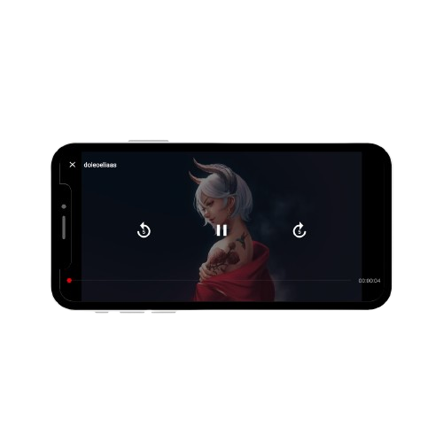
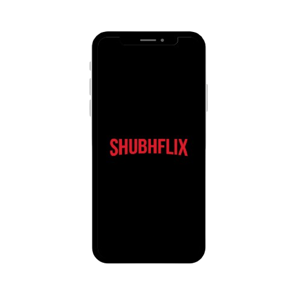

# 🎬 ShubhFlix - Android Video Streaming App

ShubhFlix is an Android video streaming app built using **ExoPlayer, MVVM, Retrofit, and Dagger Hilt**. It allows users to watch videos with a smooth playback experience, optimized caching, and dependency injection for better maintainability.


---

## 📸 Screenshots




---

## 🚀 Technologies Used

- **ExoPlayer** → For video playback
- **MVVM (Model-View-ViewModel)** → For clean architecture
- **Retrofit** → For API calls
- **Dagger Hilt** → For dependency injection
- **PixaBay** -> Free video api

---

## 📌 Features & Functionality

- 🎥 **ExoPlayer Integration** → Provides smooth video playback with advanced controls.
- 🔄 **MVVM Architecture** → Ensures a scalable and testable app structure.
- 🌐 **Retrofit API Calls** → Fetches video data dynamically from an API.
- 🛠 **Dagger Hilt** → Handles dependency injection for modular and efficient code.
- 🎚 **Custom UI Controls** → Implements forward, rewind, and seek functionalities.

---


## 🛠 Setup & Installation

1. Clone the repository:
   ```sh
   git clone https://github.com/shubhbairwa/ShubhFlix.git
   ```
2. Open in **Android Studio**.
3. Add your **API Key** inside `local.properties`:
   ```properties
   API_KEY=your_api_key_here
   ```
4. Run the project! 🚀

---

## 📞 Contact

For any queries, feel free to reach out!

🔗 [GitHub](https://github.com/shubhbairwa/ShubhFlix) | 📧 [Gmail](mailto\:shubhamver61002@gmail.com)

